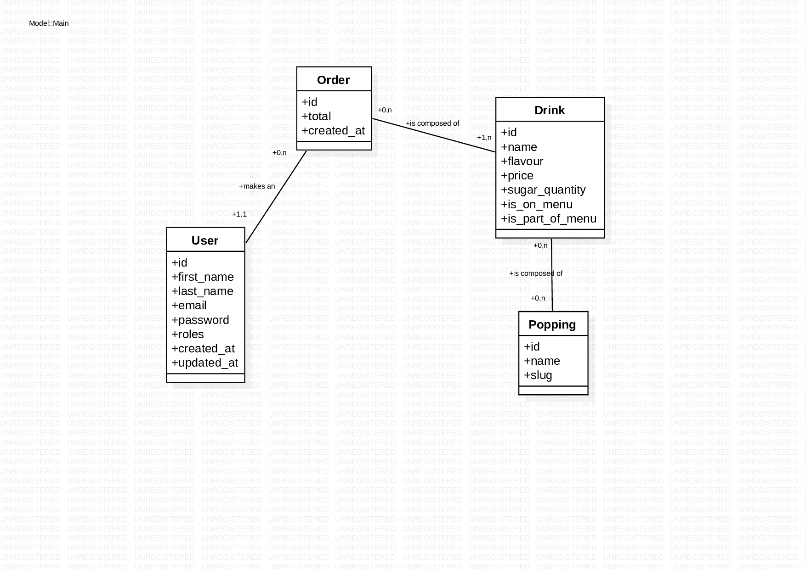

# Bubble Tea

> created by Mathilde Turra, as part of an internship recruitment process.

A simple e-commerce website to order bubble tea, with possibility to add poppings and change the quantity of sugar, as well as a admin page to manage the drinks presented on the menu.
<br>
Project coded with PHP, Twig and Bootstrap on Symfony 6.

## Class Diagram 



## Logins

The project has Data Fixtures, so you can load them with 
```console
symfony console doctrine:database:create
```
```console
symfony console doctrine:migrations:migrate
```
```console
symfony console doctrine:fixtures:load
```
and then log in with the provided users :
```console
Mathilde (ADMIN) - email : mathilde@bbtea.com, password : admin
Jane (USER) - email : jane@user.com, password : ackn0wledged 
```